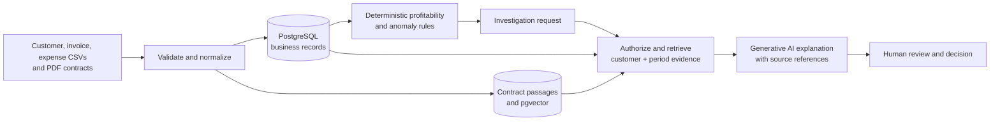

# ProfitLens

**An AI-driven, context-aware business profitability and decision intelligence system**

ProfitLens is a B.Tech COM-711 Minor Project for small and growing businesses. It aims to connect customer records, invoices, expenses, and contracts so an authorized user can see where customer contribution or margin changed, investigate why, and inspect the underlying evidence.

The product separates **financial facts** from **AI explanation**. Validated records and deterministic formulas will calculate revenue, attributed costs, contribution, and margin. Rules will flag potential pricing mismatches, cost increases, and margin declines. A permission-aware retrieval layer will combine relevant structured records with contract passages; a pretrained model will explain findings with source references. The model will not calculate authoritative financial figures or decide access rights.

## Current status

**Week 1 of 12 complete — repository foundation and data ingestion preview.** The repository currently contains a CSV validation and customer/period linking preview, text extraction for text-based PDF contracts, tests, and architecture notes. It does **not** yet contain a production API, database, dashboard, authentication, or an AI integration. [View verified progress](docs/ROADMAP.md).

## Planned investigation flow



The diagram is a **target architecture**, not a claim that every component is already built. See [architecture and data boundaries](docs/ARCHITECTURE.md).

## Week 1 preview

The Python ingestion module validates three CSV record types, rejects malformed values and duplicate IDs, checks customer references and billing-period formatting, links records by customer and period, and extracts page-attributed text from a PDF. It reports errors and incomplete-period warnings before anything is saved. PDF parsing currently requires selectable text; OCR and verified contract-term extraction are later work.

Requirements: Python 3.11 or later. From the repository root:

```powershell
python -m venv .venv
.venv\Scripts\Activate.ps1
python -m pip install -e .
python -m profitlens.ingestion.preview --organization-id demo-org --customers data/demo/customers.csv --invoices data/demo/invoices.csv --expenses data/demo/expenses.csv
python -m unittest discover -s tests -v
```

The preview writes a JSON summary to the terminal and does not persist uploaded data. An optional PDF can be supplied with `--contract-pdf path/to/contract.pdf --contract-customer-id C001`; do not use confidential business documents in the demo dataset.

## Delivery approach

The project follows a twelve-week development period. The target is an integrated web application with secure business-data workflows, deterministic profitability analysis, explainable findings, and evidence-linked AI investigations. Synthetic data and tests will develop alongside each feature, followed by controlled retrieval and embedding-quantization experiments and a final demonstration.

Detailed weekly planning is maintained privately by the team. The public [progress record](docs/ROADMAP.md) reports verified work, and the [project brief](docs/PROJECT_BRIEF.md) describes the intended scope.

## Boundaries

ProfitLens is a decision-support prototype, not an accounting or payment system. The college demo will use synthetic data. Findings depend on data quality, and estimated opportunities require human verification. Advanced integrations, autonomous financial actions, and a custom foundation model are outside the 12-week scope.

## Project documents

- [Project brief](docs/PROJECT_BRIEF.md) — goals, scope, and success criteria
- [Architecture](docs/ARCHITECTURE.md) — components, data flow, and security boundaries
- [Data contracts](docs/DATA_CONTRACTS.md) — Week 1 input formats and financial assumptions
- [Progress record](docs/ROADMAP.md) — verified milestones and current limitations
- [Coding-agent guide](AGENTS.md) — implementation conventions and source-of-truth order

## Ownership

This project is being developed by a team. Project idea and copyright: Karan Kirti Sharma. See [LICENSE.md](LICENSE.md) for the repository's current use terms.
