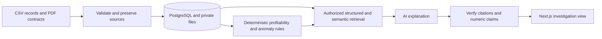

# ProfitLens

**Investigate changes in customer profitability and trace findings back to business records.**

ProfitLens is a 12-week B.Tech COM-711 group project building a business intelligence web application for small and growing businesses. It brings customer records, invoices, attributed expenses, and PDF contracts into one workflow. The planned system will calculate contribution and margin in code, flag reviewable pricing and cost issues, and help authorized users investigate them through evidence-linked AI explanations.

> **Project status — Week 1 complete (27 September 2026).** The repository currently contains a working *local ingestion preview*: CSV validation and customer/period linking, page-referenced PDF text extraction, synthetic examples, and automated tests. The web app, database, financial engine, and AI investigation features are planned. [See verified progress](docs/ROADMAP.md).

## The problem it addresses

A business may have an updated contract price in a PDF, recent invoices in a spreadsheet, and customer costs in another file. Seeing a falling margin is useful; identifying the records behind that change is more useful. ProfitLens is designed to connect those records and let a user review a calculation and its sources before acting.

The intended investigation path is:

1. **Validate** customer, invoice, expense, and contract inputs, retaining source rows and PDF pages.
2. **Calculate** net billed revenue, attributed costs, contribution, and margin using deterministic rules.
3. **Flag** pricing mismatches, unusual cost increases, and margin declines with traceable inputs.
4. **Retrieve** relevant records and contract passages within the user's organization and customer permissions.
5. **Explain** a finding in plain language with checked source references, limitations, and suggestions for human review.

## What works today

| Week 1 capability | Current behavior |
| --- | --- |
| CSV import preview | Validates customers, invoices, and expenses; reports row errors, duplicate IDs, unknown customers, invalid periods, invoice-total mismatches, and mixed currencies. |
| Customer-period links | Groups invoice and expense IDs by customer and billing month; warns when one side is missing rather than assuming a zero cost. |
| PDF contract text | Extracts selectable text with page references; reports unsupported or unreadable PDFs. Contract terms are not automatically verified. |
| Reproducibility | Synthetic CSV examples and nine focused unit tests. The preview writes no business records to a database. |

## Planned architecture



This diagram shows the **target product**. The Week 1 implementation covers local validation and PDF text extraction. Future components will use FastAPI, PostgreSQL, pgvector, and a Next.js/TypeScript interface. [Read the architecture and trust boundaries](docs/ARCHITECTURE.md).

## Try the Week 1 preview

Install Python 3.11 or later. From a PowerShell terminal in the repository root:

```powershell
python -m venv .venv
.\.venv\Scripts\python.exe -m pip install -e .
.\.venv\Scripts\python.exe -m profitlens.ingestion.preview --organization-id demo-org --customers data/demo/customers.csv --invoices data/demo/invoices.csv --expenses data/demo/expenses.csv
.\.venv\Scripts\python.exe -m unittest discover -s tests -v
```

The CLI prints a JSON report with `valid`, record counts, customer-period links, warnings, errors, and `persisted: false`. To inspect a text-based contract PDF, add `--contract-pdf path/to/contract.pdf --contract-customer-id C001` to the preview command. The PDF must have selectable text; the current parser does not perform OCR. On macOS/Linux, activate `.venv` and use `python` in place of the Windows `.venv` executable.

## Delivery approach

The project is planned over twelve weeks. Storage, authentication, and the first web screens come early; financial rules and a dashboard follow; then contract retrieval, evidence-backed investigations, output verification, quantization experiments, and a final demonstration. Detailed team planning is kept privately. The public [progress record](docs/ROADMAP.md) lists only verified work.

The academic evaluation will use a reproducible synthetic dataset. Planned measures include calculation accuracy, anomaly precision and recall, access-control checks, retrieval relevance, citation support, answer correctness, and response time. A quantized embedding model will be compared with an unquantized counterpart for memory use and retrieval quality; no result is assumed in advance.

## Repository guide

| Path | Purpose |
| --- | --- |
| `apps/api/profitlens/ingestion/` | Current CSV/PDF preview and validation models. |
| `data/demo/` | Synthetic input examples. |
| `tests/` | Focused behavior tests; also run by GitHub Actions. |
| [Project brief](docs/PROJECT_BRIEF.md) | Problem, academic contribution, scope, and acceptance evidence. |
| [Architecture](docs/ARCHITECTURE.md) | Planned components, provenance, security, and financial boundaries. |
| [Data contracts](docs/DATA_CONTRACTS.md) | Supported Week 1 CSV fields and amount semantics. |
| [Progress](docs/ROADMAP.md) | Completed milestones and current limitations. |
| [Agent guide](AGENTS.md) | Conventions for the approved project team and coding agents. |

## Scope and use

ProfitLens is a decision-support prototype. It is not an accounting authority or payment system. Estimated opportunities need human review, and results depend on the completeness of supplied data. The college demo uses synthetic records; real customer data and secrets must not be committed. The code is publicly viewable, while [LICENSE.md](LICENSE.md) reserves reuse rights.

The project is being developed by a team. Project idea and copyright: Karan Kirti Sharma.
