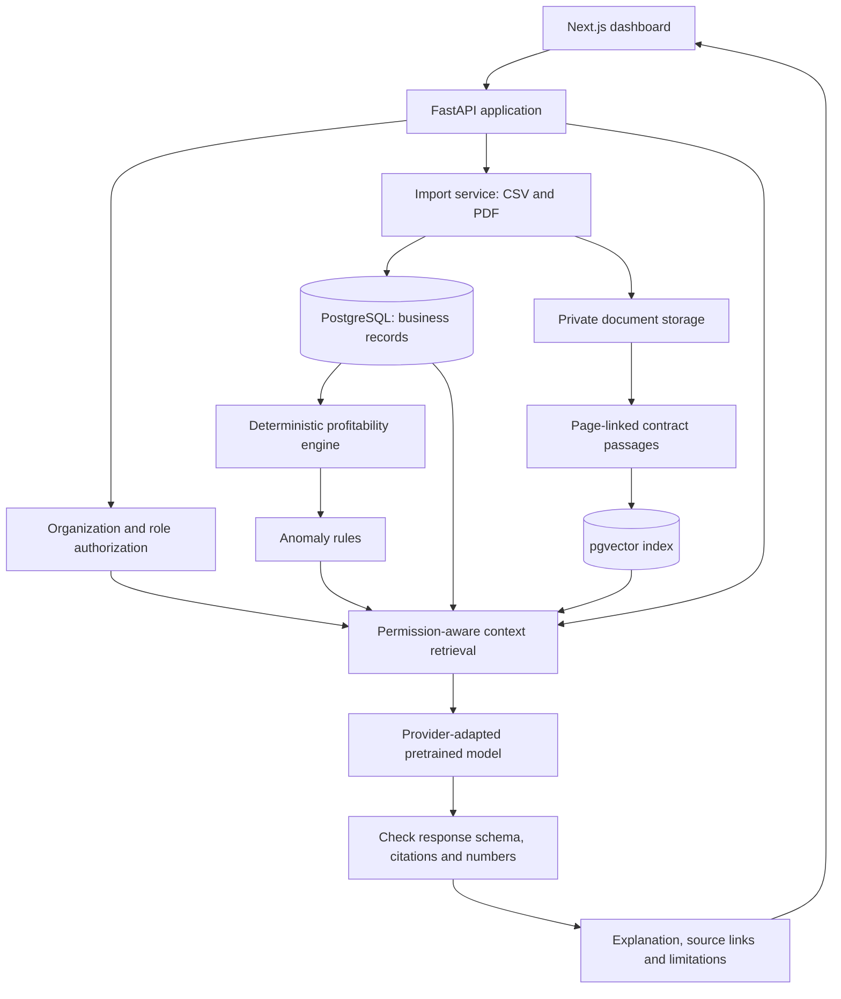

# ProfitLens architecture

**Status:** Target design. Only the local Week 1 CSV/PDF ingestion preview exists in code today. The diagram and later sections describe the intended web application.

## Planned components



The application will use a Next.js/TypeScript interface, a FastAPI service, PostgreSQL for business records, pgvector for contract passage search, and private storage for uploaded PDFs. Keep financial calculations and permission checks in the API. The AI provider receives only authorized context and cannot create authoritative financial values or approve access.

## Working software and planned components

| Component | Current state |
| --- | --- |
| CSV and PDF preview | Working locally: schema validation, customer/period links, row errors, completeness warnings, and page-referenced selectable PDF text. |
| Persistent business records and web/API workflows | Planned. |
| Profitability calculations and anomaly findings | Planned. |
| Contract search, evidence retrieval, and AI verification | Planned. |

The import preview returns `persisted: false`. The backend, database and web paths shown below will be created as working features in later milestones.

## Data and trust boundaries

An import will receive its organization ID from an authenticated API session, never from a CSV cell. It will validate row shape, identifiers, decimal amounts, dates, and customer references before persistence. A confirmed import will keep the source file and row for each record and avoid duplicate writes on retry. Contract PDFs will be stored privately; extracted text and candidate terms remain unverified until a user checks them.

The API will enforce organization, role, and customer scope before querying relational records or vector passages. It will filter retrieved evidence again before constructing a bounded context pack. The same checks apply to document downloads, citation links, and saved investigations, including when permissions change. Contract text is treated as evidence, not as instructions to the application.

An AI response must match a structured schema. Citation IDs must belong to the authorized context pack, and displayed financial values must match deterministic metrics for the same customer and period. Missing or unsupported evidence produces a visible limitation rather than a confident finding. Citation validity alone does not prove that a passage supports a claim; the evaluation will check that separately.

## Financial boundary

For the supported project dataset, invoice `subtotal` is before discount and excludes tax. The supported `refund` is a pre-tax reduction in the same period. Net billed revenue is `subtotal - discount - refund`; tax is excluded. Attributed costs are linked to the same customer and billing period. Contribution is revenue minus attributed costs; margin is contribution divided by revenue only when revenue is positive. Duplicates, missing costs, unsupported credit notes, and unmatched periods must be handled explicitly. See the [input and amount contracts](DATA_CONTRACTS.md).

## Initial repository layout

```text
apps/api/profitlens/ingestion/  Week 1 import preview
data/demo/                    Synthetic sample CSVs
docs/                         Public scope, design, verified progress, contracts
tests/                        Import behavior tests
```

`apps/web/`, database migrations, API routes, and deployment configuration will be added as working features. The team's detailed planning and local session memory are Git-ignored and are not required to run the public Week 1 preview.
