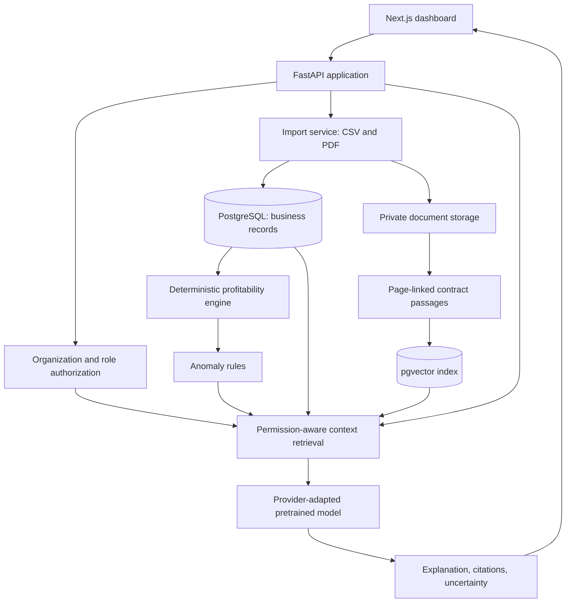

# Architecture

## Planned components



This is the 12-week target. Week 1 implements only local import validation and PDF text extraction.

## Data and trust boundaries

An import receives an authenticated organization's ID from the backend, never from a CSV cell. It validates row shape, identifiers, decimal amounts, dates, and customer references before persistence. Every stored record will retain an import/source reference. A contract PDF's extracted text and candidate terms remain unverified until a user checks them.

The API will enforce organization and role scope before querying relational records or vector passages. Retrieved evidence is filtered again before constructing a context pack. The generative model sees only authorized evidence, returns source identifiers, and is never allowed to grant permissions or calculate the authoritative margin.

## Financial boundary

For the project dataset, invoice `subtotal` is pre-discount and excludes tax. Net revenue is `subtotal - discount - refund`; tax is excluded. Attributed costs are linked to the same customer and billing period. Contribution is net revenue minus attributed costs; margin is contribution divided by net revenue when net revenue is positive. Missing costs and unresolved refunds are flagged rather than silently treated as zero. See [data contracts](DATA_CONTRACTS.md).

## Initial repository layout

```text
apps/api/profitlens/ingestion/  Week 1 import preview
data/demo/                    Synthetic sample CSVs
docs/                         Scope, design, roadmap, contracts
tests/                        Import behavior tests
```

`apps/web/`, database migrations, API routes, and deployment configuration will be added in their planned weeks when there is working code to document.
